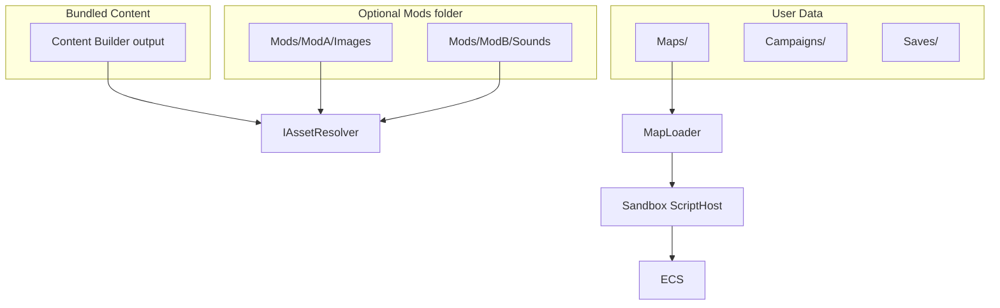

# Структура проекта и инфраструктура TinyTBS

## Цели архитектуры

- **Один код игры** на всех платформах: правила, ECS, карты, строки, скрипты.
- **Bundled контент** (Content-проект) + **content-моды** (юниты, баланс, maps/levels/campaigns, ассеты; сейчас в коде в основном override графики/звука).
- **User data** на диске: карты, уровни, кампании, сохранения, загрузки — через абстракцию путей.
- **Свой формат Map / Level**, встроенный редактор, скрипты в **ограниченной песочнице**.
- **Tiled / DotTiled — не используются.**
- **Три слоя кода** (папки, не отдельный csproj): **логика**, **представление**, **движок**. См. ADR 0005.
- **GDD** — [docs/GAME_DESIGN.md](../../docs/GAME_DESIGN.md); Map/Level/Campaign — ADR 0006; юниты data-driven — UNIT_FORMAT.
- **Сеть** — позже; типы игроков Remote закладывать в API заранее.




## Структура solution


| Проект              | Назначение                                                                                                                  |
| ------------------- | --------------------------------------------------------------------------------------------------------------------------- |
| **TinyTBS.Core**    | **Логика:** карты, кампании (модели), скрипты, сохранения, `IFileContentProvider`, `IUserDataPaths`, `IAssetResolver`, `GameCommand`. |
| **TinyTBS.Content** | Исходники + C# Content Builder → **стандартные** ресурсы сборки.                                                            |
| **TinyTBS.Game**    | **Представление** (MGE screens, Gum UI) + **движок** (layout, input poll, draw systems); редактор.                        |
| **TinyTBS.Desktop** | Точка входа.                                                                                                                |


## Пути к данным (кросс-платформенно)

Вся работа с путями — через `**IUserDataPaths**` / `**IFileContentProvider**`, не через `Path.Combine` к exe в Core.


| Каталог             | Desktop (типично)              | Mobile (будущее)                                      |
| ------------------- | ------------------------------ | ----------------------------------------------------- |
| **Mods**            | `{InstallDir}/Mods/{ModName}/` | `{AppData}/Mods/` или scoped storage (не install dir) |
| **Maps**            | `{UserData}/Maps/`             | `{AppData}/Maps/`                                     |
| **Campaigns**       | `{UserData}/Campaigns/`        | то же                                                 |
| **Saves**           | `{UserData}/Saves/`            | то же                                                 |
| **Downloads cache** | `{UserData}/Downloads/`        | то же                                                 |


**Моды рядом с установкой** — естественно на **Windows/Linux desktop**. На **Android** папка установки часто **read-only**; моды кладут в **app-specific external storage** или импорт через «выбрать папку». Архитектура та же (`IAssetResolver`), реализация путей другая — **переделывать Game не нужно**.

## Моды (сейчас → цель)

**Сейчас:** `IAssetResolver` — Images/Sounds override, `mod.json`, выбор в меню.

**Цель (GDD / content packs):** юниты (UNIT_FORMAT), баланс, maps/levels/campaigns, скрипты, ассеты. Vanilla — тот же формат данных. Локализация модов (resx) — позже.

На mobile корневые пути модов другие — контракт тот же, реализация `IUserDataPaths` / install dir.

## Цвета игроков на спрайтах (юниты и строения)

**Задача:** один PNG на тип юнита/строения; до **10 игроков + нейтральный**; цвета выбирает игрок (color picker); два состояния — **активный** и **затемнённый** (уже походил). Не хранить 11×2 готовых вариантов текстур.

**Это реализуемо в MonoGame.** Рекомендуемая стратегия — **комбинация слоёв + tint при отрисовке**; опционально **шейдер** для однослойных спрайтов.

### Подход A — слои (рекомендуется для старта)

Для каждого юнита/строения — **2 PNG** (или base + несколько масок):


| Файл              | Содержимое                                                            |
| ----------------- | --------------------------------------------------------------------- |
| `knight_base.png` | Некрасящиеся детали (лицо, металл, фон)                               |
| `knight_team.png` | **Белая/серая** маска областей перекраски (щит, плащ) — альфа = форма |


Отрисовка:

```csharp
spriteBatch.Draw(baseTex, pos, Color.White);
spriteBatch.Draw(teamMaskTex, pos, playerColor);  // Color = выбранный цвет игрока
// затемнённый: playerColor * dimFactor (например 0.55f)
```

- **10 игроков + нейтральный** — только разные `Color` при `Draw`, **без** дублирования файлов.
- **Затемнение** — умножение цвета (`Color * 0.55f`) или отдельный uniform; второй набор PNG **не нужен**.
- Работает на **DesktopGL и будущем Android** без кастомных шейдеров.
- Художнику понятный пайплайн; моды могут подменять те же пары файлов.

Несколько зон (крыша + флаг): `building_base.png`, `building_roof_mask.png`, `building_flag_mask.png` — каждая маска красится своим цветом или одним `PlayerColor`.

### Подход B — шейдер «замена ключевого цвета»

Один PNG: перекрашиваемые области нарисованы **фиксированными маркерными RGB** (например `#FF00FF`, `#00FFFF`).

Custom `Effect` (HLSL → MGFX): в pixel shader, если цвет пикселя близок к маркеру — подставить `PlayerColor1` / `PlayerColor2` из uniform.

- Плюс: один файл на юнита.
- Минус: дисциплина для художника; отладка шейдера; тест на всех платформах.
- **Затемнение:** uniform `DimFactor` в конце shader.

Подходит, если позже захотите упростить ассеты; можно мигрировать с подхода A.

### Под approach C — CPU-подмена пикселей (не рекомендуется на рантайме)

`Texture2D.GetData` / `SetData` или генерация текстур при смене цвета в picker → **кэш** `Dictionary<(unitId, color), Texture2D>`.

- Имеет смысл только как **опциональный кэш** после выбора цвета (редко меняется), не каждый кадр.
- На 10 игроков × много юнитов — риск по памяти, если bake всё подряд.

### Color picker и настройки

- В настройках матча/игрока: **Gum** UI (ползунки RGB / HSV или готовый виджет).
- В Core/Game: `PlayerPalette` — массив `Color` (slot 0…9 + `NeutralColor` для незахваченных строений).
- Сохранять в настройках профиля / save match setup (JSON).

### Итог для плана


| Решение              | Выбор                                            |
| -------------------- | ------------------------------------------------ |
| Формат ассетов       | **base + mask** PNG на перекрашиваемые зоны      |
| Цвета игроков        | tint при `SpriteBatch.Draw`, не отдельные файлы  |
| Затемнение «походил» | `Color * dimFactor`, один draw path              |
| Шейдер               | опционально позже (ADR), если захотите один слой |
| Bake текстур         | только кэш по желанию, не по умолчанию           |


## Карты, уровни и кампании

Иерархия: **Map → Level → Campaign** (ADR 0006). Канон: `docs/GAME_DESIGN.md`, `MAP_FORMAT`, `LEVEL_FORMAT`, `CAMPAIGN_FORMAT`.

**Map** — `.map.zip` в `{UserData}/Maps/` (или embed в Level): terrain, строения, слоты/юниты, `script.cs`.

**Level** — играбельная партия: map embed **или** ref; игроки/команды; золото; лимит юнитов; win/lose; mode tags.

**Кампания** — пакет/папка:

```
Campaigns/MyCampaign/
  campaign.json    # id, title, порядок **levels**
  levels/          # .level.zip или ссылки
  campaign.script  # опц.
```

`campaign.json`: список level id (не сырые map напрямую). Схватка использует Level/Map без кампании.

## Формат карты (.map.zip)

ZIP + `map.json` (слои surface, buildings, units, опц. memorials) + `script.cs`. Детали — `docs/MAP_FORMAT.md`.

## Скрипты: хуки и аргументы

**Хуки:**

- `**OnPlayerTurnStart**`
- `**OnAfterPlayerAction**`

**Аргументы хуков** — один объект контекста (не десяток параметров), например `**MapScriptContext`**:


| Свойство / раздел | Содержимое                                                                     |
| ----------------- | ------------------------------------------------------------------------------ |
| `PlayerId`        | чей ход / кто совершил действие                                                |
| `Money`           | ресурсы текущего игрока (и при необходимости readonly-словарь по всем игрокам) |
| `Map`             | снимок или **read-only view** карты: размер, surface-слой                      |
| `Units`           | коллекция юнитов: id, тип, позиция, HP, владелец, флаги                        |
| `Buildings`       | коллекция построек: тип, позиция, владелец, состояние                          |
| `LastAction`      | только в `OnAfterPlayerAction`: тип действия, источник, цель, результат        |


Скрипт **читает** через контекст; **изменяет** только через явные методы API (`context.AddMoney(...)`, `context.SetVictory(...)`, …), а не прямую мутацию внутренних структур ECS.

Для `OnAfterPlayerAction` — тот же контекст + `**LastAction**` с деталями последнего хода игрока.

## Безопасность скриптов карт (песочница)

**Честная оценка:** полноценная «непробиваемая» песочница для **произвольного C#** в .NET **сложна** (нет старого Code Access Security). Но для **одиночной игры** и доверенных/полудоверенных авторов карт — **практичный набор мер** работает.

### Уровень 1 — архитектура (обязательно, с первого дня)

- Скрипт **не видит** `File`, `Directory`, `HttpClient`, `Process`, `Assembly`, `Environment` — их **нет в globals** и **нет в разрешённых using**.
- Единственный вход — `**MapScriptContext**` с whitelist-методами.
- Хост вызывает **только** именованные функции хуков; произвольный `Main` не запускается.

### Уровень 2 — Roslyn (C# сейчас)

```csharp
ScriptOptions.Default
  .WithReferences(typeof(MapScriptContext).Assembly)  // только ScriptingApi + минимум
  .WithImports()  // пусто или только System.Linq при необходимости
```

- **Не** подключать полный `System.Runtime` с reflection-heavy surface без нужды; минимальный набор ссылок.
- Шаблон `script.cs` **без** `using System.IO` — только сигнатуры хуков.
- **Таймаут** выполнения (CancellationToken) на каждый вызов хука.
- **Запрет `#r`** и post-load assembly load в настройках скрипта где возможно.

### Уровень 3 — если C# окажется слишком дырявым

- **Lua** (MoonSharp / NLua) или **JavaScript** (Jint с отключённым доступом к CLR) — **проще изолировать**; `IScriptEngine` уже заложен под смену языка.
- **Precompile** при публикации карты: скрипт компилируется в DLL, реализующий только `IMapScriptHooks` — без Roslyn в рантайме (удобно для Android).

### Уровень 4 — парanoia (опционально позже)

- Запуск хука в **отдельном процессе** с IPC — дорого, но максимальная изоляция.
- Подпись карт от доверенных авторов.

**Рекомендация для плана:** старт с **Уровня 1 + 2**; в `docs/SCRIPTING.md` явно описать ограничения; для UGC-мастерской позже рассмотреть Lua или precompile.

## Сохранения (формат — проработать отдельно)

Пока **не фиксируем полный набор полей** — закладываем **версионируемую**, **расширяемую** схему.

**Два уровня сохранений:**


| Тип               | Когда                         | Пример содержимого                                                                                                              |
| ----------------- | ----------------------------- | ------------------------------------------------------------------------------------------------------------------------------- |
| **Match save**    | середина битвы на одной карте | seed, текущий ход, ECS-состояние (юниты, здания, деньги), RNG state, id карты                                                   |
| **Campaign save** | прогресс сценария             | id кампании, индекс текущей карты, флаги сюжета, переносимые между картами ресурсы/юниты (если задумано), ссылки на match saves |


**Принципы:**

- `**saveVersion**` в корне JSON — миграции при смене формата.
- `**extensions**` или typed blocks — карта/кампания могут добавлять **свои** ключи (скриптовые флаги), не ломая ядро.
- Отдельные файлы: `saves/match_{id}.json` vs `saves/campaign_{id}.json`.
- Что именно сериализовать из ECS — решить после появления первого playable (ADR + `docs/SAVE_FORMAT.md`).

## Workflow: что будет, когда вы скажете «делай»

**«Делай»** = переход в **Agent mode** и **реализация кода/файлов** по плану (по шагам или одной порцией — как договоримся в сообщении).

**По умолчанию я НЕ делаю:**

- `git commit` — **только если вы явно попросите** («закоммить», «сделай коммит»).
- `git push` — **только если вы явно попросите** («запушь»).

После работы вы **смотрите diff** в Cursor (Source Control / изменённые файлы), **осмысливаете**, при необходимости просите правки — и **сами решаете**, когда коммитить. Это будет зафиксировано в `**AGENTS.md`** при первом шаге реализации:

- Не создавать коммиты и не пушить без явной просьбы пользователя.
- После изменений — кратко перечислить, что изменилось; пользователь ревьюит diff перед коммитом.

**Типичный цикл:**

1. Вы: «делай шаг 1 — разнести solution».
2. Я: создаю/меняю файлы, по возможности проверяю сборку.
3. Вы: смотрите diff, задаёте вопросы или «исправь X».
4. Вы: «закоммить с сообщением …» — только тогда commit (push отдельно, если нужно).

**Push в remote** — отдельное явное действие; без него изменения остаются только локально.

## Порядок внедрения

Согласовано с `docs/ARCHITECTURE.md`:

1. Core + Content + Game + Desktop; **IUserDataPaths**, **IAssetResolver** — **выполнено**.
2. docs/ + GDD (`GAME_DESIGN.md`, design/*, UNIT/LEVEL formats, ADR 0006) — **выполнено**.
3. Gum + MGE screens — **выполнено**.
4. Слой команд ввода + pointer — **выполнено**.
5. ECS + минимальный match (демо ≠ полный GDD) — **выполнено**.
6. layer-split Screens + MatchState/MatchScene — **выполнено**.
7. `.map.zip` / **Level** загрузчики + сближение матча с GDD.
8. **MapScriptContext** + Roslyn sandbox + хуки.
9. **Content-моды** (UNIT_FORMAT + ассеты); редактор карт/уровней.
10. Кампании и сохранения — после playable loop.
11. **Сеть** — позже (Remote в API игроков заранее).

## Документация в репозитории

- `docs/ARCHITECTURE.md`, `docs/GAME_DESIGN.md`, `docs/design/*`
- `docs/MAP_FORMAT.md`, `docs/LEVEL_FORMAT.md`, `docs/UNIT_FORMAT.md`, `docs/CAMPAIGN_FORMAT.md`
- `docs/SCRIPTING.md`, `docs/SAVE_FORMAT.md`
- `docs/adr/` — в т.ч. 0005 (слои), **0006 (Map/Level/Campaign)**
- `AGENTS.md` — git-workflow без auto-commit/push; ссылка на GDD

## Риски

- C# sandbox не абсолютный — документировать; для публичного UGC рассмотреть Lua/precompile.
- Моды на mobile — другие корневые пути, не «рядом с exe».
- Сохранения — не over-engineer до первого playtest; версия + extensions достаточно на старте.

