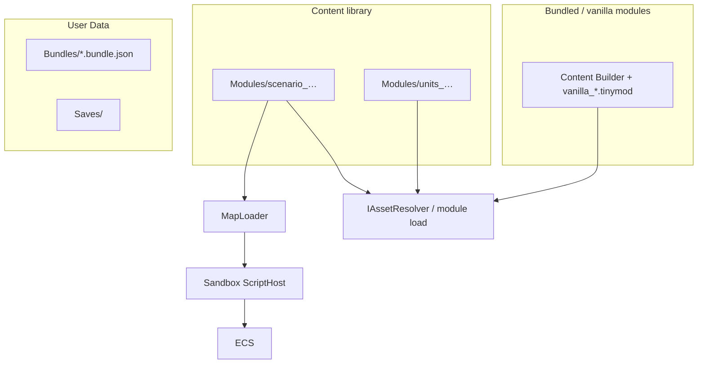

# Структура проекта и инфраструктура TinyTBS

## Статус (чеклист)

### Сделано

- [x] Engine + Content + Game + Desktop (ADR 0007)
- [x] TinyTBS.Content + Content Builder → Desktop/Content
- [x] IAssetResolver: overlay Modules/{id} → bundled (полный состав партии — later)
- [x] IUserDataPaths: Content/Modules, Bundles, Saves, Downloads
- [x] Gum на MGE-экранах
- [x] Слой команд; positional геймпад; 3 столбца биндов
- [x] ECS MGE + GameplayScreen
- [x] Слои Screens: логика / представление / движок
- [x] ADR 0007 Game vs Engine; GumLayout
- [x] Канон GDD + CONTENT_MODULE_FORMAT + ADR 0008; tinypack в archive
- [x] UI_AND_FLOW (экраны, HUD, пауза, магазин, менеджер модулей)
- [x] Демо: terrain + base/mask + PlayerPalette
- [x] docs/ ARCHITECTURE, ADR, AGENTS, MAP/SCRIPT/SAVE formats

### Дальше

- [x] **map-format** — Maps/ в scenario-модуле + загрузчик; логические id
- [x] **level-format** — Level + map.ref + загрузчик
- [x] **map-scripting** — IScriptEngine + Roslyn; MapScriptContext
- [ ] **match-ui-gdd** — статус-бар, пауза/миникарта, магазин, инфо, хотсит
- [ ] **content-mods** — .tinymod.zip + Bundles; экран Контент; состав на Новая игра
- [ ] **campaigns** — campaign.json в scenario-модуле
- [ ] **save-format** — сейвы + contentSetup
- [ ] **map-editor** — workspace модулей; Publish greyed
- [ ] **player-colors** — color picker + dimFactor «походил»
- [ ] **network-later** — Remote в API; UI greyed only

## Цели архитектуры

- **Один код игры** на всех платформах: правила, ECS, карты, строки, скрипты.
- **Bundled контент** (Content-проект) + **content-моды** (юниты, баланс, maps/levels/campaigns, ассеты; сейчас в коде в основном override графики/звука).
- **User data** на диске: карты, уровни, кампании, сохранения, загрузки — через абстракцию путей.
- **Свой формат Map / Level**, встроенный редактор, скрипты в **ограниченной песочнице**.
- **Tiled / DotTiled — не используются.**
- **Три логических слоя** (логика / представление / движок) — ADR 0005; проекты — **Game + Engine** (ADR 0007), не «один слой = один csproj».
- **GDD** — [docs/GAME_DESIGN.md](../../docs/GAME_DESIGN.md); UI/экраны — [docs/design/UI_AND_FLOW.md](../../docs/design/UI_AND_FLOW.md); Map/Level/Campaign — [ADR 0006](../../docs/adr/0006-map-level-campaign.md); юниты data-driven — [UNIT_FORMAT](../../docs/UNIT_FORMAT.md).
- **Сеть** — позже; тип Remote в API; в UI пункты мультиплеера / «пригласить по сети» — **greyed**. Хотсит (локальные игроки) — рабочий сценарий без ИИ.
- **Идеи (не канон)** — [docs/ideas/](../../docs/ideas/) (напр. frosted glass UI).




## Структура solution


| Проект              | Назначение                                                                                                                  |
| ------------------- | --------------------------------------------------------------------------------------------------------------------------- |
| **TinyTBS.Game**    | Правила, модели map/level, экраны / деревья Gum, `GameCommand`, матч; смысл модов (`IAssetResolver`). |
| **TinyTBS.Engine**  | Pointer, layout/draw ECS, **GumLayout**, `IUserDataPaths` / файлы. |
| **TinyTBS.Content** | Исходники + Content Builder → `.xnb` в `TinyTBS.Desktop/Content/` (gitignore). |
| **TinyTBS.Desktop** | Точка входа (`Desktop → Game → Engine`). |


## Пути к данным (кросс-платформенно)

Вся работа с путями — через **`IUserDataPaths`** / **`IFileContentProvider`** (`Engine.IO`), не через `Path.Combine` к exe в игровом коде.


| Каталог             | Desktop (типично)                         | Mobile (будущее)      |
| ------------------- | ----------------------------------------- | --------------------- |
| **Modules**         | `{UserData}/Content/Modules/{moduleId}/`  | app data              |
| **Bundles**         | `{UserData}/Content/Bundles/*.bundle.json`| app data              |
| **Saves**           | `{UserData}/Saves/`                       | то же                 |
| **Downloads cache** | `{UserData}/Downloads/`                   | то же (сеть позже)    |


**Моды рядом с установкой** — естественно на **Windows/Linux desktop**. На **Android** папка установки часто **read-only**; моды кладут в **app-specific external storage** или импорт через «выбрать папку». Архитектура та же (`IAssetResolver`), реализация путей другая — **переделывать Game не нужно**.

## UI и экраны (канон)

Полный текст: [docs/design/UI_AND_FLOW.md](../../docs/design/UI_AND_FLOW.md). Кратко для плана:

### Ввод

- Одно логическое действие → одна привязка **на устройство**; в настройках **три столбца**: клавиатура / геймпад / тач (можно переключать устройство mid-game).
- Геймпад: **positional** (south/east/north…); в UI — иконки под Xbox/PS/Nintendo.
- В матче: **низ** = основное, **право** = доп. (инфо), **верх** = завершить ход юнита без атаки (post-move).

### Главное меню

Продолжить · Новая игра · Загрузка · Контент · Редактор · Настройки · Об игре · Выход.  
Новая игра: scenario + состав (units/buildings/theme); сеть — greyed. Хотсит ок. Мультиплеер — greyed.

### Экран матча

| Зона | Содержимое |
|------|------------|
| Сверху | Статус-бар (цвет игрока, золото, номер хода) |
| Центр | Поле; контекстные метки **в уголках клеток** |
| Снизу | Общие подсказки (меню/пауза, конец хода игрока, …) |

- Камера: central dead-zone ½ экрана; зум **nearest-neighbor** (bicubic — опция настроек позже).
- Инфо (доп.): юнит + террейн (+ здание с tint владельца, если есть). Осн. по своему неактивному — ничего.
- Магазин замка: окно размера central zone; fallback — полная ширина между статус-баром и нижней панелью. Спавн на замке, сразу выбран; при занятости клетки — обязан сходить.
- Пауза: Конец хода · **Карта** · Цели · Сохранить/Загрузить (solo + хотсит; сеть — нет) · Меню.

### Редактор / модули / сеть

- Библиотека модулей `.tinymod.zip` — [CONTENT_MODULE_FORMAT.md](../../docs/CONTENT_MODULE_FORMAT.md); [ADR 0008](../../docs/adr/0008-content-modules.md); tinypack в archive.
- Редактор: workspace; shared → Export в модуль; Undo; валидация не блокирует Save; Publish greyed.
- Новая игра: scenario + состав (defaults/bundle); типы на карте обязаны резолвиться.
- Сеть: greyed UI only. Хотсит: Save/Load ок.

## Моды (сейчас → цель)

**Сейчас:** `IAssetResolver` — Images/Sounds override.

**Цель:** модули scenario/units/buildings/theme; vanilla — те же модули.

## Цвета игроков на спрайтах (юниты и строения)

**Задача:** один PNG на тип юнита/строения; до **10 игроков + нейтральный**; цвета выбирает игрок (color picker); два состояния — **активный** и **затемнённый** (уже походил). Не хранить 11×2 готовых вариантов текстур.

**Это реализуемо в MonoGame.** Рекомендуемая стратегия — **комбинация слоёв + tint при отрисовке**; опционально **шейдер** для однослойных спрайтов.

### Подход A — слои (рекомендуется для старта)

Для каждого юнита/строения — **2 PNG** (или base + несколько масок):


| Файл              | Содержимое                                                            |
| ----------------- | --------------------------------------------------------------------- |
| `knight_base.png` | Некрасящиеся детали (лицо, металл, фон)                               |
| `knight_team.png` | **Белая/серая** маска областей перекраски (щит, плащ) — альфа = форма |


Отрисовка:

```csharp
spriteBatch.Draw(baseTex, pos, Color.White);
spriteBatch.Draw(teamMaskTex, pos, playerColor);  // Color = выбранный цвет игрока
// затемнённый: playerColor * dimFactor (например 0.55f)
```

- **10 игроков + нейтральный** — только разные `Color` при `Draw`, **без** дублирования файлов.
- **Затемнение** — умножение цвета (`Color * 0.55f`) или отдельный uniform; второй набор PNG **не нужен**.
- Работает на **DesktopGL и будущем Android** без кастомных шейдеров.
- Художнику понятный пайплайн; моды могут подменять те же пары файлов.

Несколько зон (крыша + флаг): `building_base.png`, `building_roof_mask.png`, `building_flag_mask.png` — каждая маска красится своим цветом или одним `PlayerColor`.

### Подход B — шейдер «замена ключевого цвета»

Один PNG: перекрашиваемые области нарисованы **фиксированными маркерными RGB** (например `#FF00FF`, `#00FFFF`).

Custom `Effect` (HLSL → MGFX): в pixel shader, если цвет пикселя близок к маркеру — подставить `PlayerColor1` / `PlayerColor2` из uniform.

- Плюс: один файл на юнита.
- Минус: дисциплина для художника; отладка шейдера; тест на всех платформах.
- **Затемнение:** uniform `DimFactor` в конце shader.

Подходит, если позже захотите упростить ассеты; можно мигрировать с подхода A.

### Под approach C — CPU-подмена пикселей (не рекомендуется на рантайме)

`Texture2D.GetData` / `SetData` или генерация текстур при смене цвета в picker → **кэш** `Dictionary<(unitId, color), Texture2D>`.

- Имеет смысл только как **опциональный кэш** после выбора цвета (редко меняется), не каждый кадр.
- На 10 игроков × много юнитов — риск по памяти, если bake всё подряд.

### Color picker и настройки

- В настройках матча/игрока: **Gum** UI (ползунки RGB / HSV или готовый виджет).
- В Game: `PlayerPalette` — массив `Color` (slot 0…9 + `NeutralColor` для незахваченных строений).
- Сохранять в настройках профиля / save match setup (JSON).

### Итог для плана

| Решение              | Выбор                                            |
| -------------------- | ------------------------------------------------ |
| Формат ассетов       | **base + mask** PNG на перекрашиваемые зоны      |
| Цвета игроков        | tint при `SpriteBatch.Draw`, не отдельные файлы  |
| Затемнение «походил» | `Color * dimFactor`, один draw path              |
| Шейдер               | опционально позже (ADR), если захотите один слой |
| Bake текстур         | только кэш по желанию, не по умолчанию           |

**Статус кода:** в демо уже `PlayerPalette` + `TeamMaskedSprite` + terrain в `Content/Images/`. Осталось: dimFactor «походил», color picker в Gum, выбор цвета в лобби схватки.


## Карты, уровни и кампании

Иерархия: **Map → Level → Campaign** внутри **scenario**-модуля ([ADR 0006](../../docs/adr/0006-map-level-campaign.md), [0008](../../docs/adr/0008-content-modules.md)). Канон: [CONTENT_MODULE_FORMAT](../../docs/CONTENT_MODULE_FORMAT.md), [MAP_FORMAT](../../docs/MAP_FORMAT.md), [LEVEL_FORMAT](../../docs/LEVEL_FORMAT.md), [CAMPAIGN_FORMAT](../../docs/CAMPAIGN_FORMAT.md).

**Map** — каталог `Maps/{id}/` в scenario-модуле (`map.json` + `script.cs`); типы на карте — логические id `namespace/localId`.

**Level** — только `map.ref` внутри того же scenario-модуля (embed нет).

**Кампания** — `Campaign/` в scenario-модуле (`campaign.json` + опц. script).

Состав units/buildings/theme на старте партии — отдельно от scenario (defaults / bundle / вручную).

## Скрипты: хуки и аргументы

**Хуки:**

- `**OnPlayerTurnStart**`
- `**OnAfterPlayerAction**`

**Аргументы хуков** — один объект контекста (не десяток параметров), например `**MapScriptContext`**:


| Свойство / раздел | Содержимое                                                                     |
| ----------------- | ------------------------------------------------------------------------------ |
| `PlayerId`        | чей ход / кто совершил действие                                                |
| `Money`           | ресурсы текущего игрока (и при необходимости readonly-словарь по всем игрокам) |
| `Map`             | снимок или **read-only view** карты: размер, surface-слой                      |
| `Units`           | коллекция юнитов: id, тип, позиция, HP, владелец, флаги                        |
| `Buildings`       | коллекция построек: тип, позиция, владелец, состояние                          |
| `LastAction`      | только в `OnAfterPlayerAction`: тип действия, источник, цель, результат        |


Скрипт **читает** через контекст; **изменяет** только через явные методы API (`context.AddMoney(...)`, `context.SetVictory(...)`, …), а не прямую мутацию внутренних структур ECS.

Для `OnAfterPlayerAction` — тот же контекст + `**LastAction**` с деталями последнего хода игрока.

## Безопасность скриптов карт (песочница)

**Честная оценка:** полноценная «непробиваемая» песочница для **произвольного C#** в .NET **сложна** (нет старого Code Access Security). Но для **одиночной игры** и доверенных/полудоверенных авторов карт — **практичный набор мер** работает.

### Уровень 1 — архитектура (обязательно, с первого дня)

- Скрипт **не видит** `File`, `Directory`, `HttpClient`, `Process`, `Assembly`, `Environment` — их **нет в globals** и **нет в разрешённых using**.
- Единственный вход — `**MapScriptContext**` с whitelist-методами.
- Хост вызывает **только** именованные функции хуков; произвольный `Main` не запускается.

### Уровень 2 — Roslyn (C# сейчас)

```csharp
ScriptOptions.Default
  .WithReferences(typeof(MapScriptContext).Assembly)  // только ScriptingApi + минимум
  .WithImports()  // пусто или только System.Linq при необходимости
```

- **Не** подключать полный `System.Runtime` с reflection-heavy surface без нужды; минимальный набор ссылок.
- Шаблон `script.cs` **без** `using System.IO` — только сигнатуры хуков.
- **Таймаут** выполнения (CancellationToken) на каждый вызов хука.
- **Запрет `#r`** и post-load assembly load в настройках скрипта где возможно.

### Уровень 3 — если C# окажется слишком дырявым

- **Lua** (MoonSharp / NLua) или **JavaScript** (Jint с отключённым доступом к CLR) — **проще изолировать**; `IScriptEngine` уже заложен под смену языка.
- **Precompile** при публикации карты: скрипт компилируется в DLL, реализующий только `IMapScriptHooks` — без Roslyn в рантайме (удобно для Android).

### Уровень 4 — парanoia (опционально позже)

- Запуск хука в **отдельном процессе** с IPC — дорого, но максимальная изоляция.
- Подпись карт от доверенных авторов.

**Рекомендация для плана:** старт с **Уровня 1 + 2**; в [SCRIPTING.md](../../docs/SCRIPTING.md) явно описать ограничения; для UGC-мастерской позже рассмотреть Lua или precompile.

## Сохранения (формат — проработать отдельно)

Пока **не фиксируем полный набор полей** — закладываем **версионируемую**, **расширяемую** схему.

**Два уровня сохранений:**


| Тип               | Когда                         | Пример содержимого                                                                                                              |
| ----------------- | ----------------------------- | ------------------------------------------------------------------------------------------------------------------------------- |
| **Match save**    | середина битвы на одной карте | seed, текущий ход, ECS-состояние (юниты, здания, деньги), RNG state, id карты                                                   |
| **Campaign save** | прогресс сценария             | id кампании, индекс текущей карты, флаги сюжета, переносимые между картами ресурсы/юниты (если задумано), ссылки на match saves |


**Принципы:**

- `**saveVersion**` в корне JSON — миграции при смене формата.
- `**extensions**` или typed blocks — карта/кампания могут добавлять **свои** ключи (скриптовые флаги), не ломая ядро.
- Отдельные файлы: `saves/match_{id}.json` vs `saves/campaign_{id}.json`.
- Что именно сериализовать из ECS — решить после появления первого playable (ADR + [SAVE_FORMAT.md](../../docs/SAVE_FORMAT.md)).

## Workflow: что будет, когда вы скажете «делай»

**«Делай»** = переход в **Agent mode** и **реализация кода/файлов** по плану (по шагам или одной порцией — как договоримся в сообщении).

**По умолчанию я НЕ делаю:**

- `git commit` — **только если вы явно попросите** («закоммить», «сделай коммит»).
- `git push` — **только если вы явно попросите** («запушь»).

После работы вы **смотрите diff** в Cursor (Source Control / изменённые файлы), **осмысливаете**, при необходимости просите правки — и **сами решаете**, когда коммитить. Это будет зафиксировано в [AGENTS.md](../../AGENTS.md) при первом шаге реализации:

- Не создавать коммиты и не пушить без явной просьбы пользователя.
- После изменений — кратко перечислить, что изменилось; пользователь ревьюит diff перед коммитом.

**Типичный цикл:**

1. Вы: «делай шаг 1 — разнести solution».
2. Я: создаю/меняю файлы, по возможности проверяю сборку.
3. Вы: смотрите diff, задаёте вопросы или «исправь X».
4. Вы: «закоммить с сообщением …» — только тогда commit (push отдельно, если нужно).

**Push в remote** — отдельное явное действие; без него изменения остаются только локально.

## Порядок внедрения

Согласовано с [ARCHITECTURE.md](../../docs/ARCHITECTURE.md):

1. Engine + Content + Game + Desktop; **IUserDataPaths**, **IAssetResolver** — **выполнено** (Core убран, ADR 0007).
2. docs/ + GDD (`GAME_DESIGN.md`, design/*, UNIT/LEVEL formats, ADR 0006) — **выполнено**.
3. Gum + MGE screens — **выполнено**.
4. Слой команд ввода + pointer; канон positional / 3 столбца биндов (`UI_AND_FLOW`) — **выполнено** (полный UI биндов — впереди).
5. ECS + минимальный match + демо-арты terrain/base+mask — **выполнено** (демо ≠ полный GDD).
6. layer-split Screens + MatchState/MatchScene; ADR 0007 Game/Engine — **выполнено**.
7. `UI_AND_FLOW.md` (экраны, HUD, пауза, магазин) — **выполнено** (канон); реализация матч-UI — pending.
8. Maps/Levels в scenario-модуле + загрузчики + сближение матча с GDD.
9. **MapScriptContext** + Roslyn sandbox + хуки.
10. Матч UI по канону + playable loop.
11. Библиотека `.tinymod.zip` + Bundles + экран Контент + редактор workspace.
12. Кампании и сохранения (`contentSetup`) — после playable loop.
13. **Сеть** — позже (Remote в API; UI greyed).

## Документация в репозитории

- [ARCHITECTURE.md](../../docs/ARCHITECTURE.md), [GAME_DESIGN.md](../../docs/GAME_DESIGN.md), [docs/design/](../../docs/design/) (**в т.ч. [UI_AND_FLOW.md](../../docs/design/UI_AND_FLOW.md)**, [TURN_AND_UI.md](../../docs/design/TURN_AND_UI.md))
- [CONTENT_MODULE_FORMAT.md](../../docs/CONTENT_MODULE_FORMAT.md), [archive/content-pack-v1/](../../docs/archive/content-pack-v1/) (устаревший tinypack)
- [docs/ideas/](../../docs/ideas/) — отложенные идеи (**не** канон; напр. frosted glass)
- [MAP_FORMAT.md](../../docs/MAP_FORMAT.md), [LEVEL_FORMAT.md](../../docs/LEVEL_FORMAT.md), [UNIT_FORMAT.md](../../docs/UNIT_FORMAT.md), [BUILDING_FORMAT.md](../../docs/BUILDING_FORMAT.md), [CAMPAIGN_FORMAT.md](../../docs/CAMPAIGN_FORMAT.md)
- [SCRIPTING.md](../../docs/SCRIPTING.md), [SAVE_FORMAT.md](../../docs/SAVE_FORMAT.md), [ARTIST_GUIDE.md](../../docs/ARTIST_GUIDE.md)
- [docs/adr/](../../docs/adr/) — 0005–**0008** (модули)
- [AGENTS.md](../../AGENTS.md) — git-workflow; проекты Engine/Game/…

## Риски

- C# sandbox не абсолютный — документировать; для публичного UGC рассмотреть Lua/precompile.
- Моды на mobile — другие корневые пути, не «рядом с exe».
- Сохранения — не over-engineer до первого playtest; версия + extensions достаточно на старте.

