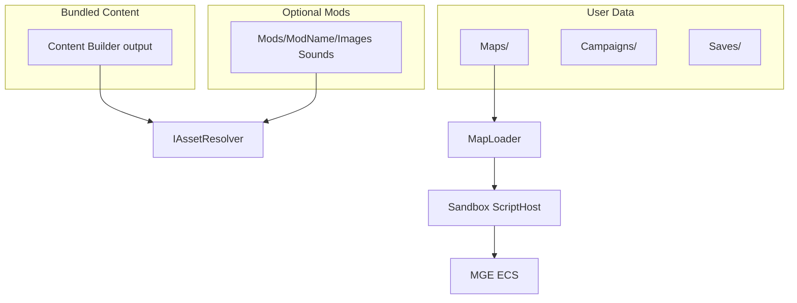

# Архитектура TinyTBS

> Выжимка согласованного плана. Обновлять при смене решений; историю — в [docs/adr/](adr/).

## Репозиторий

В git два независимых solution:

| Каталог | Проект |
|---------|--------|
| `TinyTBS/` | **MonoGame** — единственная активная кодовая база |
| `Tiny TBS Unity/` | Unity — **не изменять** при работе над MonoGame |

## Цели

- Один код игры для desktop (Windows, Linux; Android позже).
- **Bundled** контент + опциональные **графические/звуковые моды**.
- **User data:** карты, кампании, сохранения, загрузки — через абстракции путей.
- **Свой редактор карт** и формат `.map.zip`; Tiled не используется.
- **Gum** поверх **MGE Screen** на всех экранах (меню и геймплей).
- **ECS** — MonoGame.Extended.

## Структура solution (целевая)

```
TinyTBS/
  TinyTBS.Core/       # ECS, карты, скрипты, IFileContentProvider, IUserDataPaths, IAssetResolver
  TinyTBS.Content/    # Images/, Sounds/, Strings/*.resx, C# Content Builder
  TinyTBS.Game/       # Game, Gum, MGE screens, редактор, ввод
  TinyTBS.Desktop/    # Program.cs, DesktopGL
  docs/
```

Сейчас — один проект; разнесение — первый шаг реализации.

## Стек

| Компонент | Выбор |
|-----------|--------|
| Runtime | .NET 10 |
| Framework | MonoGame 3.8.5 DesktopGL |
| Расширения | MonoGame.Extended 6 (экраны, ECS) |
| UI | Gum.MonoGame + MVVM (ручная синхронизация) |
| Контент | C# Content Builder, wildcard Include |
| Карты | ZIP + JSON + script.cs |
| Скрипты | Roslyn (C#), IScriptEngine для других языков позже |
| Локализация | resx |

## Потоки данных



## Пути к данным

Через `IUserDataPaths` / `IFileContentProvider` — не хардкодить пути к exe в Core.

| Каталог | Desktop | Mobile (будущее) |
|---------|---------|------------------|
| Mods | `{InstallDir}/Mods/{Name}/` | app data / scoped storage |
| Maps | `{UserData}/Maps/` | app data |
| Campaigns | `{UserData}/Campaigns/` | app data |
| Saves | `{UserData}/Saves/` | app data |
| Downloads | `{UserData}/Downloads/` | app data |

## Моды

`IAssetResolver`: запрос ресурса → активный мод → fallback на bundled Content. Каждый мод — подпапка с `Images/`, `Sounds/`, опционально `mod.json`. Выбор мода в меню.

## Цвета игроков на спрайтах

Base + mask PNG, tint при отрисовке; затемнение «уже походил» через `Color * dimFactor`. До 10 игроков + нейтральный — без дублирования файлов. Подробно: [ARTIST_GUIDE.md](ARTIST_GUIDE.md).

## Gum + MGE

Каждый экран — MGE `Screen`. Порядок отрисовки: игровая сцена → Gum (UI, оверлеи).

## Ввод

Слой **команд игры** поверх API MonoGame (`Keyboard`, `Mouse`, `GamePad`, позже `TouchPanel`): устройство + привязка → логическое действие (`Confirm`, `EndTurn`, …). Не опрашивать клавиатуру из ViewModel напрямую.

## Карты и кампании

- Карта: [MAP_FORMAT.md](MAP_FORMAT.md)
- Скрипты: [SCRIPTING.md](SCRIPTING.md)
- Кампании: [CAMPAIGN_FORMAT.md](CAMPAIGN_FORMAT.md) (черновик)
- Сохранения: [SAVE_FORMAT.md](SAVE_FORMAT.md) (черновик)

## MonoGame 3.8.5

- Сейчас: DesktopGL + Content Builder в Content-проекте.
- DesktopVK — единый desktop Win/Linux/Mac в перспективе.
- [Release notes](https://monogame.net/blog/2026-07-15-3.8.5-release-2026/)

## Workflow с AI

- «Делай» = реализация кода, **без** auto-commit/push.
- Коммит и push — только по явной просьбе. См. [AGENTS.md](../AGENTS.md).

## Порядок внедрения

1. Core + Content + Game + Desktop; `IUserDataPaths`, `IAssetResolver` (vanilla).
2. Документация (этот каталог).
3. MGE ScreenManager + Gum на одном экране.
4. Слой команд ввода.
5. ECS + минимальный match.
6. `.map.zip` + загрузчик.
7. MapScriptContext + Roslyn sandbox.
8. Mods fallback; редактор карт.
9. Кампании и сохранения — после playable loop.

## Связанные ADR

- [0001 — область репозитория MonoGame vs Unity](adr/0001-repo-scope-monogame-not-unity.md)
- [0002 — формат карты ZIP + JSON](adr/0002-map-format-zip-json.md)
- [0003 — отказ от Tiled, свой редактор](adr/0003-no-tiled-custom-editor.md)
- [0004 — перекраска спрайтов base + mask](adr/0004-sprite-base-mask-recoloring.md)
