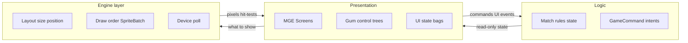
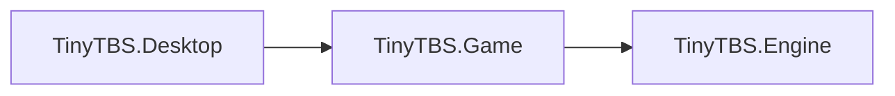
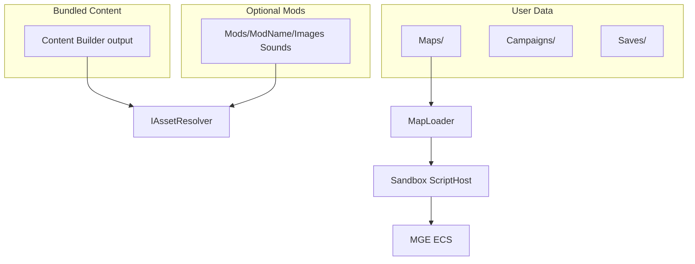

# Архитектура TinyTBS

> Выжимка согласованного плана. Обновлять при смене решений; историю — в [docs/adr/](adr/).

## Репозиторий

В git два независимых solution:

| Каталог | Проект |
|---------|--------|
| `TinyTBS/` | **MonoGame** — единственная активная кодовая база |
| `Tiny TBS Unity/` | Unity — **не изменять** при работе над MonoGame |

## Цели

- Один код игры для desktop (Windows, Linux; Android позже).
- **Bundled** контент + **content-моды** (юниты, карты, кампании, ассеты, баланс; сейчас в коде в основном override графики/звука).
- **User data:** карты, уровни, кампании, сохранения, загрузки — через абстракции путей.
- **Свой редактор** и форматы Map / Level; Tiled не используется.
- **Gum** поверх **MGE Screen** на всех экранах (меню и геймплей).
- **ECS** — MonoGame.Extended.
- Код разделён на три слоя: **логика**, **представление**, **движок**. См. [ADR 0005](adr/0005-three-layers-logic-presentation-engine.md).
- Проекты: **Game** (игра + UI) и **Engine** (кадр / I/O). См. [ADR 0007](adr/0007-game-and-engine-projects.md).
- Геймдизайн (канон): [GAME_DESIGN.md](GAME_DESIGN.md).

## Слои (Logic / Presentation / Engine)

Логические слои (ADR 0005) живут в основном в **Game** (логика + представление) и **Engine** (инфраструктура кадра). **MVVM не целевая архитектура** — классы `*ViewModel` только тонкие мешки UI-состояния (текст HUD, список модов), не место для ввода и layout.



| Слой | Что внутри | Чего нет |
|------|------------|----------|
| **Логика** | Ходы, выбор юнита, состояние матча, карты/скрипты, `GameCommand` как намерения | Viewport, Gum, `SpriteBatch`, пиксели |
| **Представление** | Экраны, дерево Gum, подписи, навигация экранов, синхронизация текста HUD | Формулы центрирования сетки, порядок `Begin`/`End` |
| **Движок** | `MatchBoardLayout`, draw systems, fit текстуры, `GumLayout`, опрос pointer, порядок «сцена → Gum» | Правила «можно ли ходить на клетку» |

**Зависимости проектов:** `Desktop → Game → Engine`. Engine не знает типы Game.

**Где в solution:**

- Логика + представление — `TinyTBS.Game/` (`Match/`, `Screens/`, `Presentation/`, `ViewModels/`, `Input/` команд, `Assets/`)
- Инфраструктура кадра / файлов — `TinyTBS.Engine/` (`Rendering/`, `Ecs/`, `GumLayout/`, `Input/` pointer, `IO/`)
- Склейка матча (`MatchScene`, session factory) — в Game, вызывает Engine

**Склейка кадра** — тонкий MGE `GameScreen`: `Update`/`Draw` вызывают логику и движок, не содержат формул layout и правил матча.

## Структура solution

```
TinyTBS/
  TinyTBS.Engine/     # pointer, layout/draw ECS, GumLayout, IUserDataPaths / файлы
  TinyTBS.Content/    # исходники Images/, Sounds/, Strings/*.resx + Content Builder
  TinyTBS.Game/       # правила, экраны, матч, IAssetResolver / смысл модов
  TinyTBS.Desktop/    # Program.cs, DesktopGL; Content/ = build output (.xnb, gitignore)
  docs/
```



**Карты / моды:** контракты путей и файлов — `Engine.IO`; смысл мода и резолв ассетов — `Game.Assets` (`IAssetResolver`). Парсинг map/level JSON → модели → матч — **Game**. Низкоуровневые ZIP/stream/texture-from-stream хелперы — целевое место в Engine (сейчас часть загрузки текстур ещё в `GameTextureLoader`).

Bundled pipeline: исходники в **TinyTBS.Content** → builder пишет `.xnb` в **`TinyTBS.Desktop/Content/`** (см. [TinyTBS.Content/README.md](../TinyTBS.Content/README.md)).

## Стек

| Компонент | Выбор |
|-----------|--------|
| Runtime | .NET 10 |
| Framework | MonoGame 3.8.5 DesktopGL |
| Расширения | MonoGame.Extended 6 (экраны, ECS) |
| UI | Gum.MonoGame + тонкий UI-state (ручная синхронизация; не MVVM-архитектура) |
| Контент | C# Content Builder (`TinyTbsContentBuilder`, RegexRule), .xnb → Desktop |
| Карты | ZIP + JSON + script.cs |
| Скрипты | Roslyn (C#), IScriptEngine для других языков позже |
| Локализация | resx |

## Потоки данных



## Пути к данным

Через `IUserDataPaths` / `IFileContentProvider` — не хардкодить пути к exe в Game.

| Каталог | Desktop | Mobile (будущее) |
|---------|---------|------------------|
| Mods | `{InstallDir}/Mods/{Name}/` | app data / scoped storage |
| Maps | `{UserData}/Maps/` | app data |
| Campaigns | `{UserData}/Campaigns/` | app data |
| Saves | `{UserData}/Saves/` | app data |
| Downloads | `{UserData}/Downloads/` | app data |

## Моды

**Сейчас:** `IAssetResolver` — активный мод → fallback на bundled Content (`Images/`, `Sounds/`, опц. `mod.json`).

**Цель (GDD):** мод = **content pack** — юниты ([UNIT_FORMAT.md](UNIT_FORMAT.md)), строения/баланс, maps/levels/campaigns, скрипты, ассеты. Vanilla — тот же формат данных. Нестандартные юниты — конфиг + declarative `special` / abilities, не отдельный бой-движок.

## Цвета игроков на спрайтах

Base + mask PNG, tint при отрисовке; затемнение «уже походил» через `Color * dimFactor`. До 10 игроков + нейтральный — без дублирования файлов. Подробно: [ARTIST_GUIDE.md](ARTIST_GUIDE.md).

## Gum + MGE

Каждый экран — MGE `GameScreen` (склейка слоёв). Порядок отрисовки (**движок**): игровая сцена → Gum (UI, оверлеи). Дерево контролов и навигация — **представление** (`Game/Presentation/`); bootstrap и размеры/якоря — **`Engine/GumLayout`** (`GumBootstrap`, `GumUiLayout`).

## ECS (MGE)

- `TinyTBS.Game.Match`: `GridCell`, `MatchDefaults` (без пикселей), `MatchUnit`, `MatchState` — **логика** (демо; полный GDD — впереди)
- `TinyTBS.Engine.Ecs`: компоненты визуализации; `GridDrawSystem`, `UnitDrawSystem` — **движок**
- `MatchScene` / `GameplaySessionFactory` — в Game: ECS + текстуры через `IAssetResolver`; `MatchCommandApplicator` — команды/pointer→логика
- `GameplayScreen` / `MainMenuScreen` — тонкая склейка lifecycle; Gum в `Presentation/`; ассеты меню — `MainMenuBackground`

## Ввод

**Engine** опрашивает pointer (`Mouse`, позже touch) → `IPointerSource` / `ScreenPoint`.
**Game** опрашивает клавиатуру/геймпад → логические `GameCommand` (`GameCommandService`). Представление/логика не читают `Keyboard`/`Mouse` напрямую.

- `TinyTBS.Game.Input`: `GameCommand`, `IGameCommandSource`, `GameCommandService`, `DefaultInputBindings`
- `TinyTBS.Engine.Input`: `IPointerSource`, `ScreenPoint`, `PointerInputService`
- `GameMain` обновляет commands + pointer каждый кадр до `ScreenManager.Update`

## Карты, уровни, кампании

- Геймдизайн: [GAME_DESIGN.md](GAME_DESIGN.md)
- Map: [MAP_FORMAT.md](MAP_FORMAT.md)
- Level: [LEVEL_FORMAT.md](LEVEL_FORMAT.md)
- Campaign: [CAMPAIGN_FORMAT.md](CAMPAIGN_FORMAT.md)
- Units data: [UNIT_FORMAT.md](UNIT_FORMAT.md)
- Скрипты: [SCRIPTING.md](SCRIPTING.md)
- Сохранения: [SAVE_FORMAT.md](SAVE_FORMAT.md) (черновик)

## MonoGame 3.8.5

- Сейчас: DesktopGL + Content Builder в Content-проекте.
- DesktopVK — единый desktop Win/Linux/Mac в перспективе.
- [Release notes](https://monogame.net/blog/2026-07-15-3.8.5-release-2026/)

## Workflow с AI

- «Делай» = реализация кода, **без** auto-commit/push.
- Коммит и push — только по явной просьбе. См. [AGENTS.md](../AGENTS.md).

## Порядок внедрения

1. Engine + Content + Game + Desktop; `IUserDataPaths`, `IAssetResolver` (vanilla). **Core убран** — см. ADR 0007.
2. Документация (этот каталог) + GDD — **выполнено** (канон в `GAME_DESIGN.md`).
3. MGE ScreenManager + Gum на экранах — **выполнено**.
4. Слой команд ввода — **выполнено**.
5. ECS + минимальный match — **выполнено** (демо ≠ полный GDD).
6. Слои Screens + split `MatchState`/`MatchScene` + pointer — **выполнено**.
7. `.map.zip` / Level загрузчики + сближение матча с GDD.
8. MapScriptContext + Roslyn sandbox.
9. Content-моды (данные юнитов + ассеты); редактор карт/уровней.
10. Кампании и сохранения — после playable loop.
11. **Сеть** — позже (типы игроков Remote закладывать заранее).

## Связанные ADR

- [0001 — область репозитория MonoGame vs Unity](adr/0001-repo-scope-monogame-not-unity.md)
- [0002 — формат карты ZIP + JSON](adr/0002-map-format-zip-json.md)
- [0003 — отказ от Tiled, свой редактор](adr/0003-no-tiled-custom-editor.md)
- [0004 — перекраска спрайтов base + mask](adr/0004-sprite-base-mask-recoloring.md)
- [0005 — три слоя: логика / представление / движок](adr/0005-three-layers-logic-presentation-engine.md)
- [0006 — Map / Level / Campaign](adr/0006-map-level-campaign.md)
- [0007 — проекты Game и Engine](adr/0007-game-and-engine-projects.md)
