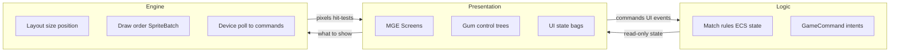
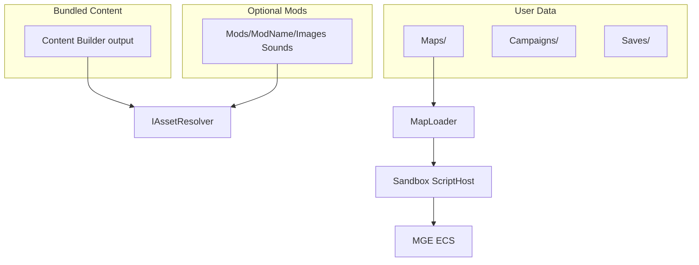

# Архитектура TinyTBS

> Выжимка согласованного плана. Обновлять при смене решений; историю — в [docs/adr/](adr/).

## Репозиторий

В git два независимых solution:

| Каталог | Проект |
|---------|--------|
| `TinyTBS/` | **MonoGame** — единственная активная кодовая база |
| `Tiny TBS Unity/` | Unity — **не изменять** при работе над MonoGame |

## Цели

- Один код игры для desktop (Windows, Linux; Android позже).
- **Bundled** контент + опциональные **графические/звуковые моды**.
- **User data:** карты, кампании, сохранения, загрузки — через абстракции путей.
- **Свой редактор карт** и формат `.map.zip`; Tiled не используется.
- **Gum** поверх **MGE Screen** на всех экранах (меню и геймплей).
- **ECS** — MonoGame.Extended.
- Код разделён на три слоя: **логика**, **представление**, **движок** — просто для чтения и правок. См. [ADR 0005](adr/0005-three-layers-logic-presentation-engine.md).

## Слои (Logic / Presentation / Engine)

Не четвёртый csproj: разделение папками внутри Core/Game. **MVVM не целевая архитектура** — классы `*ViewModel` только тонкие мешки UI-состояния (текст HUD, список модов), не место для ввода и layout.



| Слой | Что внутри | Чего нет |
|------|------------|----------|
| **Логика** | Ходы, выбор юнита, ECS-состояние матча, карты/скрипты, `GameCommand` как намерения | Viewport, Gum, `SpriteBatch`, пиксели |
| **Представление** | Экраны, дерево Gum, подписи, навигация экранов, синхронизация текста HUD | Формулы центрирования сетки, порядок `Begin`/`End` |
| **Движок** | `MatchBoardLayout`, `GumUiLayout`, draw systems, fit текстуры, опрос устройств→команды, порядок «сцена → Gum» | Правила «можно ли ходить на клетку» |

**Зависимости:** логика не ссылается на движок/Gum; представление не считает пиксели и не опрашивает `Keyboard` напрямую (только `IGameCommandSource` и события Gum).

**Где в solution:**

- Логика — `TinyTBS.Core/` (+ по мере роста — чистые правила матча вне draw-wiring)
- Движок — `TinyTBS.Game/Gum/`, `TinyTBS.Game/Input/` (команды + pointer), `TinyTBS.Game/Ecs/Systems/`, `TinyTBS.Game/Rendering/` (в т.ч. `MatchBoardLayout`)
- Представление — `TinyTBS.Game/Screens/` (тонкая склейка), `TinyTBS.Game/Presentation/` (Gum-деревья), `TinyTBS.Game/ViewModels/` (только UI-state)

**Склейка кадра** — тонкий MGE `GameScreen`: `Update`/`Draw` вызывают логику и движок, не содержат формул layout и правил матча.

## Структура solution (целевая)

```
TinyTBS/
  TinyTBS.Core/       # логика: карты, скрипты, контракты путей/ассетов, GameCommand
  TinyTBS.Content/    # Images/, Sounds/, Strings/*.resx, C# Content Builder
  TinyTBS.Game/       # представление (Screens) + движок (Gum layout, Input, draw systems)
  TinyTBS.Desktop/    # Program.cs, DesktopGL
  docs/
```

Шаг 1 выполнен: solution разнесён на Core / Content / Game / Desktop; добавлены `IUserDataPaths`, `IFileContentProvider`, `IAssetResolver` (vanilla + опциональный мод).

## Стек

| Компонент | Выбор |
|-----------|--------|
| Runtime | .NET 10 |
| Framework | MonoGame 3.8.5 DesktopGL |
| Расширения | MonoGame.Extended 6 (экраны, ECS) |
| UI | Gum.MonoGame + тонкий UI-state (ручная синхронизация; не MVVM-архитектура) |
| Контент | C# Content Builder (`TinyTbsContentBuilder`, RegexRule), .xnb → Desktop |
| Карты | ZIP + JSON + script.cs |
| Скрипты | Roslyn (C#), IScriptEngine для других языков позже |
| Локализация | resx |

## Потоки данных



## Пути к данным

Через `IUserDataPaths` / `IFileContentProvider` — не хардкодить пути к exe в Core.

| Каталог | Desktop | Mobile (будущее) |
|---------|---------|------------------|
| Mods | `{InstallDir}/Mods/{Name}/` | app data / scoped storage |
| Maps | `{UserData}/Maps/` | app data |
| Campaigns | `{UserData}/Campaigns/` | app data |
| Saves | `{UserData}/Saves/` | app data |
| Downloads | `{UserData}/Downloads/` | app data |

## Моды

`IAssetResolver`: запрос ресурса → активный мод → fallback на bundled Content. Каждый мод — подпапка с `Images/`, `Sounds/`, опционально `mod.json`. Выбор мода в меню.

## Цвета игроков на спрайтах

Base + mask PNG, tint при отрисовке; затемнение «уже походил» через `Color * dimFactor`. До 10 игроков + нейтральный — без дублирования файлов. Подробно: [ARTIST_GUIDE.md](ARTIST_GUIDE.md).

## Gum + MGE

Каждый экран — MGE `GameScreen` (склейка слоёв). Порядок отрисовки (**движок**): игровая сцена → Gum (UI, оверлеи). Дерево контролов и навигация — **представление**; размеры/якоря Gum — хелперы движка (`GumUiLayout`).

## ECS (MGE)

- `TinyTBS.Core.Match`: `GridCell`, `MatchDefaults` (без пикселей), `MatchUnit`, `MatchState` — **логика**
- `TinyTBS.Game.Ecs`: компоненты визуализации сетки/юнитов; `GridDrawSystem`, `UnitDrawSystem` — **движок**
- `MatchScene` / `GameplaySessionFactory` — ECS + загрузка текстур через `IAssetResolver`; `MatchCommandApplicator` — команды/pointer→логика
- `GameplayScreen` / `MainMenuScreen` — тонкая склейка lifecycle; Gum в `Presentation/`; ассеты меню — `MainMenuBackground`

## Ввод

**Движок** опрашивает устройства (`Keyboard`, `Mouse`, `GamePad`, позже `TouchPanel`) и отдаёт **логические** команды / pointer. Представление/логика читают `IGameCommandSource` и `IPointerSource`, не `Keyboard`/`Mouse` напрямую.

- `TinyTBS.Core.Input`: `GameCommand`, `IGameCommandSource`, `IPointerSource`, `ScreenPoint`
- `TinyTBS.Game.Input`: `GameCommandService`, `PointerInputService`, `DefaultInputBindings`
- `GameMain` обновляет commands + pointer каждый кадр до `ScreenManager.Update`

## Карты и кампании

- Карта: [MAP_FORMAT.md](MAP_FORMAT.md)
- Скрипты: [SCRIPTING.md](SCRIPTING.md)
- Кампании: [CAMPAIGN_FORMAT.md](CAMPAIGN_FORMAT.md) (черновик)
- Сохранения: [SAVE_FORMAT.md](SAVE_FORMAT.md) (черновик)

## MonoGame 3.8.5

- Сейчас: DesktopGL + Content Builder в Content-проекте.
- DesktopVK — единый desktop Win/Linux/Mac в перспективе.
- [Release notes](https://monogame.net/blog/2026-07-15-3.8.5-release-2026/)

## Workflow с AI

- «Делай» = реализация кода, **без** auto-commit/push.
- Коммит и push — только по явной просьбе. См. [AGENTS.md](../AGENTS.md).

## Порядок внедрения

1. Core + Content + Game + Desktop; `IUserDataPaths`, `IAssetResolver` (vanilla).
2. Документация (этот каталог).
3. MGE ScreenManager + Gum на экранах — **выполнено** (`MainMenuScreen`, UI-state, выбор мода «Vanilla»).
4. Слой команд ввода — **выполнено** (`GameCommand`, `IGameCommandSource`, `GameCommandService`).
5. ECS + минимальный match — **выполнено** (`MatchState` + `MatchScene`, `GameplayScreen`).
6. Разнести Screens по слоям; split матча (логика Core / сцена Game) + pointer input — **выполнено**.
7. `.map.zip` + загрузчик.
8. MapScriptContext + Roslyn sandbox.
9. Mods fallback; редактор карт.
10. Кампании и сохранения — после playable loop.

## Связанные ADR

- [0001 — область репозитория MonoGame vs Unity](adr/0001-repo-scope-monogame-not-unity.md)
- [0002 — формат карты ZIP + JSON](adr/0002-map-format-zip-json.md)
- [0003 — отказ от Tiled, свой редактор](adr/0003-no-tiled-custom-editor.md)
- [0004 — перекраска спрайтов base + mask](adr/0004-sprite-base-mask-recoloring.md)
- [0005 — три слоя: логика / представление / движок](adr/0005-three-layers-logic-presentation-engine.md)
