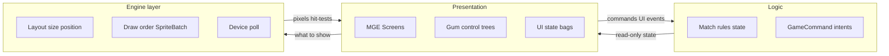
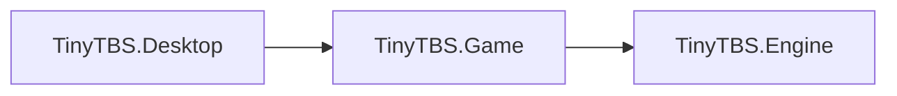
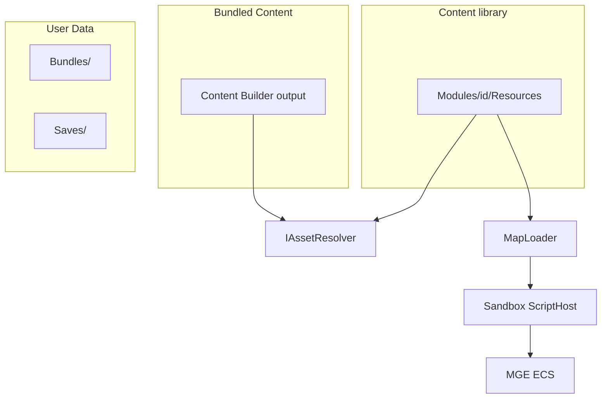

# Архитектура TinyTBS

> Выжимка согласованного плана. Обновлять при смене решений; историю — в [docs/adr/](adr/).

## Репозиторий

В git два независимых solution:

| Каталог | Проект |
|---------|--------|
| `TinyTBS/` | **MonoGame** — единственная активная кодовая база |
| `Tiny TBS Unity/` | Unity — **не изменять** при работе над MonoGame |

## Цели

- Один код игры для desktop (Windows, Linux; Android позже).
- **Bundled** контент + **content-моды** (юниты, карты, кампании, ассеты, баланс; сейчас в коде в основном override графики/звука).
- **User data:** карты, уровни, кампании, сохранения, загрузки — через абстракции путей.
- **Свой редактор** и форматы Map / Level; Tiled не используется.
- **Gum** поверх **MGE Screen** на всех экранах (меню и геймплей).
- **ECS** — MonoGame.Extended.
- Код разделён на три слоя: **логика**, **представление**, **движок**. См. [ADR 0005](adr/0005-three-layers-logic-presentation-engine.md).
- Проекты: **Game** (игра + UI) и **Engine** (кадр / I/O). См. [ADR 0007](adr/0007-game-and-engine-projects.md).
- Геймдизайн (канон): [GAME_DESIGN.md](GAME_DESIGN.md).

## Слои (Logic / Presentation / Engine)

Логические слои (ADR 0005) живут в основном в **Game** (логика + представление) и **Engine** (инфраструктура кадра). **MVVM не целевая архитектура** — классы `*ViewModel` только тонкие мешки UI-состояния (текст HUD, список модов), не место для ввода и layout.


```mermaid
flowchart LR
  subgraph logic [Logic]
    MatchRules[Match rules state]
    Commands[GameCommand intents]
  end
  subgraph presentation [Presentation]
    Screens[MGE Screens]
    GumUi[Gum control trees]
    UiState[UI state bags]
  end
  subgraph engineLayer [Engine layer]
    Layout[Layout size position]
    Draw[Draw order SpriteBatch]
    InputPoll[Device poll]
  end
  presentation -->|"commands UI events"| logic
  logic -->|"read-only state"| presentation
  presentation -->|"what to show"| engineLayer
  engineLayer -->|"pixels hit-tests"| presentation
```

| Слой | Что внутри | Чего нет |
|------|------------|----------|
| **Логика** | Ходы, выбор юнита, состояние матча, карты/скрипты, `GameCommand` как намерения | Viewport, Gum, `SpriteBatch`, пиксели |
| **Представление** | Экраны, дерево Gum, подписи, навигация экранов, синхронизация текста HUD | Формулы центрирования сетки, порядок `Begin`/`End` |
| **Движок** | `MatchBoardLayout`, draw systems, fit текстуры, `GumLayout`, опрос pointer, порядок «сцена → Gum» | Правила «можно ли ходить на клетку» |

**Зависимости проектов:** `Desktop → Game → Engine`. Engine не знает типы Game.

**Где в solution:**

- Логика + представление — `TinyTBS.Game/` (`Ai/`, `Match/`, `Maps/`, `Levels/`, `Campaigns/`, `Scripting/` domain hooks, `Screens/`, `Presentation/`, `ViewModels/`, `Input/` команд, `Assets/`)
- Инфраструктура кадра / файлов / script host — `TinyTBS.Engine/` (`Rendering/`, `Ecs/`, `GumLayout/`, `Input/` pointer, `IO/`, `Scripting/` Roslyn+sandbox+timeout)
- Склейка матча (`MatchScene`, session factory) — в Game, вызывает Engine

**Склейка кадра** — тонкий MGE `GameScreen`: `Update`/`Draw` вызывают логику и движок, не содержат формул layout и правил матча.

## Структура solution

```
TinyTBS/
  TinyTBS.Engine/     # pointer, layout/draw ECS, GumLayout, IUserDataPaths / файлы
  TinyTBS.Content/    # исходники Images/, Sounds/, Strings/*.resx + Content Builder
  TinyTBS.Game/       # правила, экраны, матч, IAssetResolver / смысл модов
  TinyTBS.Desktop/    # Program.cs, DesktopGL; Content/ = build output (.xnb, gitignore)
  docs/
```


```mermaid
flowchart LR
  Desktop[TinyTBS.Desktop] --> GameProj[TinyTBS.Game]
  GameProj --> Engine[TinyTBS.Engine]
```

**Карты / моды:** контракты путей и файлов — `Engine.IO`; смысл мода и резолв ассетов — `Game.Assets` (`IAssetResolver`). Парсинг map/level JSON → модели → матч — **Game**. Низкоуровневые ZIP/stream/texture-from-stream хелперы — целевое место в Engine (сейчас часть загрузки текстур ещё в `GameTextureLoader`).

Bundled pipeline: исходники в **TinyTBS.Content** → builder пишет `.xnb` в **`TinyTBS.Desktop/Content/`** (см. [TinyTBS.Content/README.md](../TinyTBS.Content/README.md)).

## Стек

| Компонент | Выбор |
|-----------|--------|
| Runtime | .NET 10 |
| Framework | MonoGame 3.8.5 DesktopGL |
| Расширения | MonoGame.Extended 6 (экраны, ECS) |
| UI | Gum.MonoGame + тонкий UI-state (ручная синхронизация; не MVVM-архитектура) |
| Контент | C# Content Builder (`TinyTbsContentBuilder`, RegexRule), .xnb → Desktop |
| Карты / уровни | Каталог `Maps/{id}/`, `Levels/{id}/` в scenario; JSON + `script.cs` (ZIP `.map.zip` — legacy/экспорт) |
| Скрипты | Roslyn `Microsoft.CodeAnalysis.CSharp` → `IMapScriptHooks`; `IScriptEngine` для других языков позже |
| Локализация | resx |

## Потоки данных


```mermaid
flowchart TB
  subgraph bundled [Bundled Content]
    DefaultAssets[Content Builder output]
  end
  subgraph mods [Content library]
    ModFolder[Modules/id/Resources]
  end
  subgraph userdata [User Data]
    Bundles[Bundles/]
    Saves[Saves/]
  end
  Resolver[IAssetResolver]
  DefaultAssets --> Resolver
  ModFolder --> Resolver
  ModFolder --> MapLoader
  MapLoader --> ScriptHost[Sandbox ScriptHost]
  ScriptHost --> ECS[MGE ECS]
```

## Пути к данным

Через `IUserDataPaths` / `IFileContentProvider` / `IExternalFilePicker` / `IExternalUriLauncher` (`Engine.IO`, в т.ч. NFD, Linux portal, desktop shell для http(s)) — не хардкодить пути к exe и не открывать OS-диалоги / браузер из Game. Desktop собирает `DesktopExternalFilePickers.CreateDefault()` и `DesktopShellExternalUriLauncher`.

| Каталог | Desktop | Mobile (будущее) |
|---------|---------|------------------|
| Mods / Modules | `{UserData}/Content/Modules/{moduleId}/` | app data |
| Bundles | `{UserData}/Content/Bundles/*.bundle.json` | app data |
| Saves | `{UserData}/Saves/` | app data |
| Downloads | `{UserData}/Downloads/` | app data (кэш каталога / очередь) |

## Моды

**Сейчас:** `IAssetResolver` — опциональный overlay из `Content/Modules/{id}/` → fallback на bundled Content. Полный состав контента матча — `MatchContentComposition`. Установка `.tinymod.zip` → `{UserData}/Content/Modules/{id}/` (`TinymodInstaller`); сканирование user + bundled (`ContentModuleLibrary`). Пресеты `*.bundle.json` — `ContentBundleLibrary` / `ContentBundleLocator` (user + `Vanilla/Bundles`); New Game берёт `vanilla`.

**Цель (GDD):** библиотека **модулей** [CONTENT_MODULE_FORMAT.md](CONTENT_MODULE_FORMAT.md) — scenario / units / buildings / theme. Vanilla — те же модули. Нестандартные юниты — конфиг + declarative `special` / abilities. UI менеджера модулей — `content-ui`.

## Цвета игроков на спрайтах

Base + mask PNG, tint при отрисовке; затемнение «уже походил» через `Color * dimFactor`. До 10 игроков + нейтральный — без дублирования файлов. Подробно: [ARTIST_GUIDE.md](ARTIST_GUIDE.md).

## Gum + MGE

Каждый экран — MGE `GameScreen` (склейка слоёв). Порядок отрисовки (**движок**): игровая сцена → Gum (UI, оверлеи). Дерево контролов и навигация — **представление** (`Game/Presentation/`); bootstrap и размеры/якоря — **`Engine/GumLayout`** (`GumBootstrap`, `GumUiLayout`).

**Масштаб:** сейчас Gum `EnableExpandToWindow(1f)` — canvas = окно в пикселях; константы UI/тайлов — reference-пиксели без DPI-scale. На 4K без UI scale кнопки/скролл/тайлы визуально мельчают. План: `ui-scale-hidpi` — см. [UI_AND_FLOW](design/UI_AND_FLOW.md#масштаб--разрешение), [ideas/ui-scale-hidpi.md](ideas/ui-scale-hidpi.md).

## ECS (MGE)

- `TinyTBS.Game.Match`: `GridCell`, `MatchDefaults`, `MatchUnit` / `MatchBuilding`, `MatchState` — **логика** (демо-правила; полный GDD — впереди)
- `TinyTBS.Game.Maps` / `Levels` / `Units` / `Buildings` / `Themes` / `Modules`: загрузка map/level и модулей; `MatchContentCompositionLoader` + `ContentModuleLocator` → `MatchContentCatalog`; `TinymodInstaller` / `ContentModuleLibrary`; `ContentBundleLocator` / `ContentBundleLibrary`
- `TinyTBS.Game.Scripting`: `IScriptEngine` / `RoslynMapScriptEngine`, `MapScriptHost`, `MapScriptContext` + валидатор песочницы
- `TinyTBS.Engine.Ecs`: `TilemapDrawSystem`, `TeamMaskedSpriteDrawSystem` (base + tint mask)
- `MatchScene` / `GameplaySessionFactory` / `MatchSessionLoadPipeline` — в Game: level → map → скрипт → атлас → сцена (этапы для loading screen); `MatchCommandApplicator` — команды/pointer→логика (+ хуки скрипта)
- `GameplayScreen` / `MainMenuScreen` / `LoadingScreen` / `ContentLibraryScreen` — тонкая склейка lifecycle; Gum в `Presentation/`; ассеты меню — `MainMenuBackground`

## Ввод

**Engine** опрашивает pointer (`Mouse`, позже touch) → `IPointerSource` / `ScreenPoint`.
**Game** опрашивает клавиатуру/геймпад → логические `GameCommand` (`GameCommandService`). Представление/логика не читают `Keyboard`/`Mouse` напрямую. Gum `UseGamepadDefaults` **не** включаем — фокус меню/оверлеев ведёт `HandleInput` / `Handle*GamepadNavigation` (иначе D-pad удваивается и уезжает на scrollbar). Мышь остаётся через клики Gum.

- `TinyTBS.Game.Input`: `GameCommand`, `IGameCommandSource`, `GameCommandService`, `DefaultInputBindings`
- `TinyTBS.Engine.Input`: `IPointerSource`, `ScreenPoint`, `PointerInputService`
- `GameMain` обновляет commands + pointer каждый кадр до `ScreenManager.Update`

## Карты, уровни, кампании

- Геймдизайн: [GAME_DESIGN.md](GAME_DESIGN.md)
- Map: [MAP_FORMAT.md](MAP_FORMAT.md)
- Level: [LEVEL_FORMAT.md](LEVEL_FORMAT.md)
- Campaign: [CAMPAIGN_FORMAT.md](CAMPAIGN_FORMAT.md)
- Units data: [UNIT_FORMAT.md](UNIT_FORMAT.md)
- Скрипты: [SCRIPTING.md](SCRIPTING.md)
- Сохранения: [SAVE_FORMAT.md](SAVE_FORMAT.md) (черновик)

## MonoGame 3.8.5

- Сейчас: DesktopGL + Content Builder в Content-проекте.
- DesktopVK — единый desktop Win/Linux/Mac в перспективе.
- [Release notes](https://monogame.net/blog/2026-07-15-3.8.5-release-2026/)

## Workflow с AI

- «Делай» = реализация кода, **без** auto-commit/push.
- Коммит и push — только по явной просьбе. См. [AGENTS.md](../AGENTS.md).

## Порядок внедрения

1. Engine + Content + Game + Desktop; `IUserDataPaths`, `IAssetResolver` (vanilla). **Core убран** — см. ADR 0007.
2. Документация (этот каталог) + GDD — **выполнено** (канон в `GAME_DESIGN.md`).
3. MGE ScreenManager + Gum на экранах — **выполнено**.
4. Слой команд ввода — **выполнено**.
5. ECS + минимальный match — **выполнено** (демо ≠ полный GDD).
6. Слои Screens + split `MatchState`/`MatchScene` + pointer — **выполнено**.
7. Загрузчики map + level (`map.ref`) + фикстуры; старт матча из level — **выполнено**.
8. `MapScriptContext` + Roslyn sandbox + хуки в матче — **выполнено** (cold start Roslyn — см. [ideas/match-loading-roslyn-progress.md](ideas/match-loading-roslyn-progress.md)).
9. Матч UI по канону GDD — **выполнено** (статус-бар, пауза/миникарта/цели, инфо, магазин); полный бой / экономика / post-move — впереди (`match-gdd-loop`); dimFactor — `player-colors`.
10. Vanilla modules + `MatchContentCatalog` (units/buildings → магазин/HP/спрайты) — **выполнено** (`vanilla-modules`, `content-catalog`).
11. Матч на `ContentId` — **выполнено** (`content-id-bridge`).
12. Theme + terrain/gravestone из модуля — **выполнено** (`theme-terrain`).
13. Главное меню (GDD + greyed) + экран загрузки матча с этапами — **выполнено** (`menu-shell-loading`).
14. Состав контента матча + валидация id / replaces — **выполнено** (`match-content-composition`).
15. Установка `.tinymod.zip` + сканирование библиотеки — **выполнено** (`tinymod-install`: `TinymodInstaller`, `ContentModuleLibrary`).
16. Пресеты `*.bundle.json` — **выполнено** (`bundles-runtime`: `ContentBundleLocator` / `ContentBundleLibrary`; New Game → `vanilla`).
17. Экран Контент — **выполнено** (`content-ui`: библиотека; Install From device / catalog-soon; очередь Downloads; uninstall user; Download/Update greyed).
18. Content pipeline (срезы):
    - `new-game-flow` — **выполнено** (вкладки Mode → Scenario → Level → Composition → Lobby; composition scenario-defaults/bundle; слоты Local + Bot/Remote greyed в Add-chooser; цвета слотов; unit cap в `MatchLevelBrief`, enforcement позже)
19. **`match-gdd-loop`** — **выполнено** (economy/combat/post-move по клеткам/abilities + standard victory/defeat + оверлей результата). Бывшие `match-economy-capture` + `match-combat-gdd`.
20. **`bot-search-ab`** — **выполнено** (код в `TinyTBS.Game/Ai/`: атомарный αβ Easy+Normal, quiescence у Normal, лобби Bot, `IBotSearchPolicy` шов под Hard/full-turn). Идея: [bot-difficulty-eval-depth](ideas/bot-difficulty-eval-depth.md). Hard / harness — позже.
21. **`save-format`** — match-сейвы + Continue (live → диск) + Pause Save / Leave + экран **Загрузка** (Load/Delete) — **выполнено**. Канон: [SAVE_FORMAT.md](SAVE_FORMAT.md).
22. **`campaigns`** — **выполнено** (campaign.json, linear unlock, progress save, Next/Retry, script API, Continue/Load обоих kind). Канон: [CAMPAIGN_FORMAT.md](CAMPAIGN_FORMAT.md), [SAVE_FORMAT.md](SAVE_FORMAT.md).
23. **`map-editor`** — **в работе** (код в `TinyTBS.Game/Editor/`; срезы как в плане):
    - срез 1 — Hub + CoW / open session; Publish greyed — **выполнено**
    - срез 2 — paint + Save + level-stub — **выполнено**
    - срез 3 — метки Neutral/P0–P3 + Undo/Redo + Validate — **выполнено**
    - срез 4 — Levels + Campaign + map `script.cs` + двухколоночный UX/геймпад — **выполнено**
    - срез 5 — units/buildings masters (structured UI + DocumentWriters + New Units/Buildings Module) — **выполнено**
    - срез 6 — theme master + Export Module → `{UserData}/Downloads/*.tinymod.zip` — **выполнено**
    - срез 7 — bundles (New/Edit/Delete user `*.bundle.json` + CoW bundled; Content Remove) — **выполнено**
    - срез 8 — tags/abilities/conditional heal (gate → format + runtime + editor; напр. здание лечит выбранные теги сильнее)
    - срез 9 — multi-module workspace + Shared Resources (раскладка в Resources/ при Save/Export; UX modding)
24. `player-colors` — color picker в лобби / профиле (dimFactor отрисовки уже в матче); можно совместить с профилем в `settings-ui`.
25. `settings-ui` — экран **Настройки** (меню сейчас greyed): графика (разрешение/окно, UI scale / `ui-scale-hidpi`, фильтр зума nearest vs bicubic), ввод (три столбца биндов), профиль. Persist в user data. Канон: [UI_AND_FLOW](design/UI_AND_FLOW.md#настройки).
26. `ui-scale-hidpi` — масштаб UI/поля под HiDPI и 4K (вместе с или сразу после `settings-ui`). Канон: [UI_AND_FLOW](design/UI_AND_FLOW.md#масштаб--разрешение); варианты: [ideas/ui-scale-hidpi.md](ideas/ui-scale-hidpi.md).
27. **`bot-search-harness`** — опциональный прогон αβ/eval без UI (после playtest: сделать или отменить). См. [bot-difficulty-eval-depth](ideas/bot-difficulty-eval-depth.md).
28. **`terrain-autotile`** — автотайлинг местности по 4 соседям (вариации + поворот; fallback на простой тайл). Идея: [terrain-autotile-edges](ideas/terrain-autotile-edges.md). **Перед реализацией** — обязательный gate: задать открытые вопросы из идеи (термины, примеры, оценка вариантов).
29. **Сеть** (`network-later`) — позже (Remote в API; UI greyed; протокол не проектируем до этапа).

**Playtest-перерыв (приоритет):** бот Easy/Normal → сейвы → кампании → редактор; настройки / HiDPI / harness? / автотайл / Hard-бот / сеть — после.

## Связанные ADR

- [0001 — область репозитория MonoGame vs Unity](adr/0001-repo-scope-monogame-not-unity.md)
- [0002 — формат карты ZIP + JSON](adr/0002-map-format-zip-json.md)
- [0003 — отказ от Tiled, свой редактор](adr/0003-no-tiled-custom-editor.md)
- [0004 — перекраска спрайтов base + mask](adr/0004-sprite-base-mask-recoloring.md)
- [0005 — три слоя: логика / представление / движок](adr/0005-three-layers-logic-presentation-engine.md)
- [0006 — Map / Level / Campaign](adr/0006-map-level-campaign.md)
- [0007 — проекты Game и Engine](adr/0007-game-and-engine-projects.md)
- [0008 — контент-модули вместо tinypack](adr/0008-content-modules.md)
